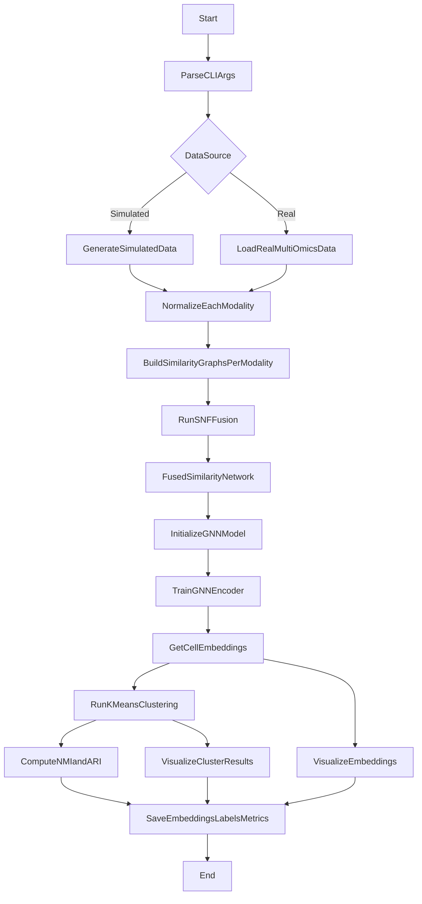

---

````markdown
# sxSNF-GNN: Single-cell Multi-omics Network Fusion with Graph Neural Networks

A framework for **single-cell multi-omics integration** based on **Similarity Network Fusion (SNF)** and **Graph Neural Networks (GNNs)**.  
This tool supports similarity graph construction, SNF fusion, deep graph representation learning, clustering, and visualization.

---

## Quick Navigation

- Repo entry (you are here): `README.md`
- Workflow chart (Mermaid): `docs/WORKFLOW.md`
- API entry (pydoc): `docs/index.html`
- API markdown index: `docs/API_REFERENCE.md`

## Overall Workflow



Search keywords: sxSNF, SNF, GNN, workflow, pipeline, clustering, embeddings, pydoc.

---

## ✨ Features

- Support for both **real data** and **simulated data**  
- Implementation of **SNF** for cross-modal similarity network fusion  
- Built-in **graph neural networks**:
  - GCN
  - GraphSAGE
  - GAT
  - VGAE
- Downstream clustering (K-means) and evaluation metrics (NMI, ARI)  
- Visualization of embeddings (t-SNE scatter plots, heatmaps, training loss curves)  
- Support for `.mat` and `.npy` data files with optional label files  

---

## 📦 Installation & Dependencies

Environment requirements:

- Python 3.8+
- PyTorch
- NumPy
- scikit-learn
- SciPy
- Matplotlib
- Seaborn

Install dependencies:

```bash
pip install -r requirements.txt
````

---

## 🚀 Usage

### 1. Real Data Mode

```bash
python main.py \
  --data_dir ./data \
  --save_dir ./results \
  --k 20 \
  --t 20 \
  --gnn_type gcn \
  --hidden_dim 128 \
  --embedding_dim 64 \
  --epochs 200 \
  --n_clusters 10 \
  --gpu 0 \
  --verbose
```

Results will be saved in the `./results` directory.

---

### 2. Simulated Data Experiment

To validate the pipeline, we provide a **simulated dataset experiment** that automatically generates two modalities (e.g., gene expression + epigenomics) with ground-truth labels.

#### Run Script

```bash
bash run_simulation.sh
```

This script calls `simulate_sxSNF.py` and saves results into `./results`.

#### Key Parameters

* `--n_samples` : Number of samples (default 500)
* `--n_features1` : Feature size of modality 1 (default 1000)
* `--n_features2` : Feature size of modality 2 (default 800)
* `--n_clusters` : Number of clusters (default 3)
* `--epochs` : Training epochs (default 100)
* `--gnn_type` : GNN type: `gcn` / `graphsage` / `gat` / `vgae`

Example:

```bash
python simulate_sxSNF.py \
  --n_samples 300 \
  --n_features1 500 \
  --n_features2 400 \
  --n_clusters 4 \
  --gnn_type gat \
  --epochs 150
```

#### Output

* **Simulated Data**

  * `simulated_data/modality1_data.npy`
  * `simulated_data/modality2_data.npy`
  * `simulated_data/labels.npy`

* **Experiment Results**

  * `results/embeddings.npy` : Learned embeddings
  * `results/cluster_labels.npy` : Predicted cluster labels
  * `results/metrics.txt` : Evaluation metrics (NMI, ARI)
  * `sxSNF_clustering_results.png` : Clustering visualization
  * `training_loss_curve.png` : Training loss curve

* **Training Snapshots**

  * `training_process/embeddings_epoch_X.npy` : Embeddings saved every 10 epochs
  * `training_process/loss_history.npy` : Loss history

---

## API Docs Generation (`pydoc`)

Generate API documentation for all top-level Python modules:

```bash
python scripts/generate_pydoc.py
```

Outputs:

- `docs/API_REFERENCE.md` (module index)
- `docs/pydoc/*.html` (per-module API pages)
- `docs/index.html` (searchable API landing page)
- `docs/WORKFLOW.md` (workflow chart for repo + docs entry)

This repository also includes GitHub Actions workflows to regenerate PyDoc and publish the `docs/` folder with GitHub Pages on pushes to `main`.

---

## 📂 Project Structure

```
.
├── main.py                  # Main pipeline (real data)
├── simulate_sxSNF.py        # Simulated data experiment
├── run_simulation.sh        # Simulation script
├── utils.py                 # Utility functions (normalization, SNF, dimensionality reduction)
├── graph_module.py          # GNN models and training
├── data/                    # Real dataset directory
├── simulated_data/          # Simulated datasets
├── results/                 # Experiment outputs
├── training_process/        # Training logs and snapshots
├── requirements.txt         # Dependencies
└── README.md                # Project documentation
```

---


## 📖 Reference

If you use this code in your research, please cite:

* Duan H., Xia L.C., *sxSNF: Single-cell Multi-modal Data Integration with Similarity Network Fusion and Graph Learning*, **APBC 2025**.

---


