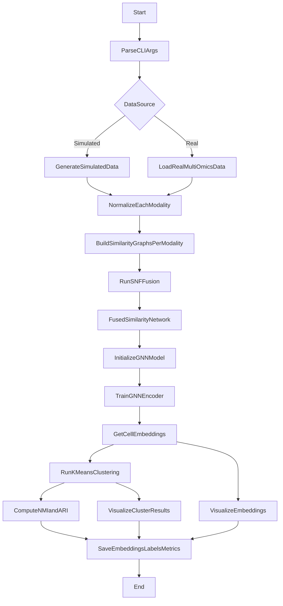

# sxSNF Overall Workflow

This page is the high-level workflow entry for the repository and pydoc documentation.

## Pipeline Diagram

## Search Keywords

sxSNF, SNF, GNN, workflow, pipeline, multi-omics, similarity graph, fusion, embeddings, clustering, NMI, ARI, pydoc.
