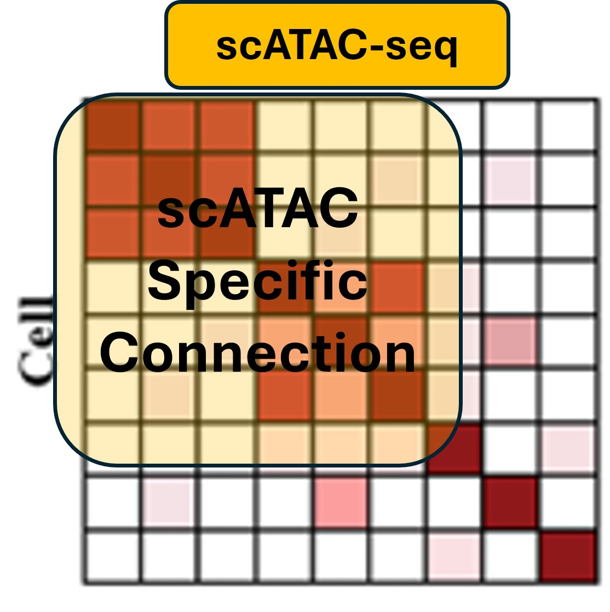
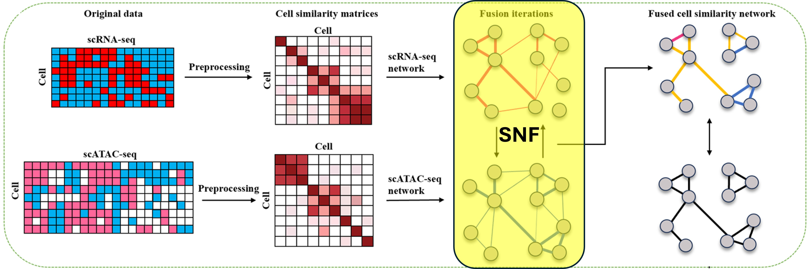
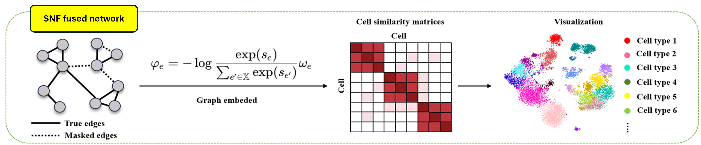
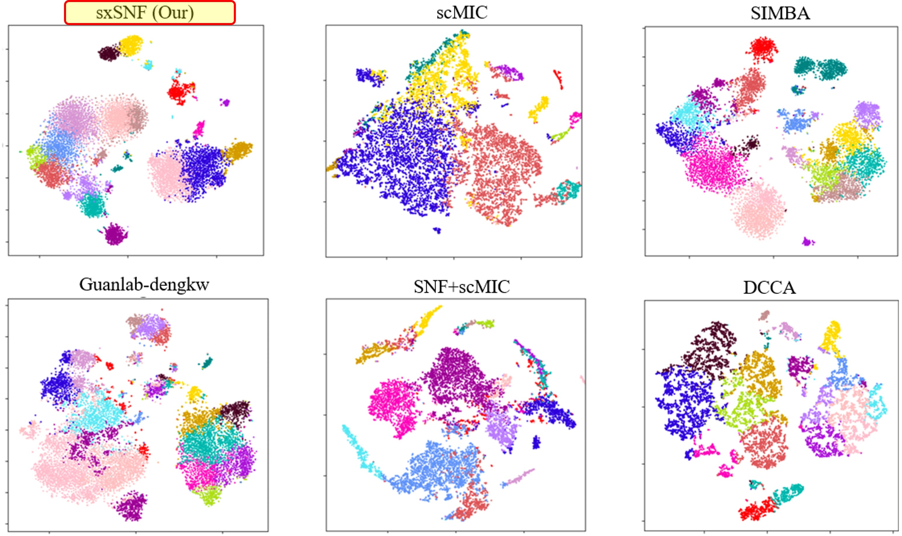
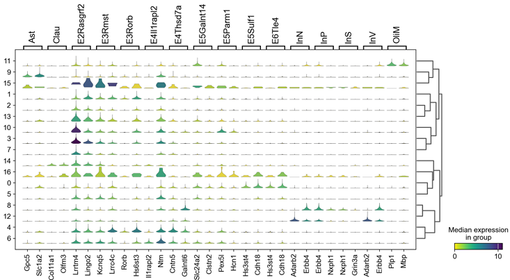

# sxSNF: A Novel Single-Cell Multi-Modal Data Integration Method Combining Similarity Network Fusion and Deep Graph Learning

**Department of Statistics and Financial Mathematics**  
School of Mathematics, South China University of Technology  

_APBC 2025 · The 23rd Asia Pacific Bioinformatics Conference_  
_September 19-22, 2025 · Nanjing, China_

<!-- agent: title type -->

---

## Challenges in Single Cell Multi-Modal Integration

<!-- agent: frame type 2col text vs figure layout -->

| | |
|:---|:---|
| **Challenges:**  - **Cell Group Connection Variability**: Cell connections vary in dynamics, resulting in shifted group representation across modalities - **Limited Complementary Leveraging**: Previous methods not leveraging modality complementary information - **Batch Effects**: Modality specific distortions  **Our Proposed Algorithm (sxSNF):** - **Similarity Network Fusion (SNF)** : Initially in ref. [1], align complementary similarities across modalities through a soft mutual diffusive process - **Dual Graph Representation**: Preserve modality-specific structures during the diffusion  - **Network-based Representation Learning**: not prone to batch effects |   |

---

## Methods of Fusion

<!-- agent: frame type simple -->

- **Existing: Simple Concatenation**  
  $$
  X_{combined} = [X^{(1)}, X^{(2)}, \ldots, X^{(M)}]
  $$
  - Loses intrinsic structure of each modality; Suffers from scale differences; ...
  
- **Existing: Weighted Integration**  
  $$
  X_{fused} = \sum_{m=1}^{M} \alpha_m X^{(m)}, \quad \sum_{m=1}^{M} \alpha_m = 1
  $$
  - Difficult to determine optimal weights; Static weighting ignores modal-specific structure; ...
  
- **Our Idea: bring in SNF Fusion** (highlighted)
  $$
  P^{(m)}(t+1)= S^{(m)} \frac{\sum_{k \neq m} P^{(k)}(t)}{M-1} (S^{(m)})^T
  $$
  - $P^{(m)}$: cross-modal similarity matrix ; $S^{(m)}$: modality-specific similarity matrix; $M$ total modalities.  
  - **SNF** enables information flow in fusion while retaining local structures

---

## sxSNF: SNF-based Cross-modal Graph Fusion

<!-- agent: frame type toppic -->

- Preprocess modal specific similarity matrices (e.g.  scRNA-seq / scATAC-seq)   
- Build modality-specific cell connection graphs (KNN)
- Apply SNF to iteratively exchange neighborhood information between modals
- Output a modal fused cell similarity network

---

## sxSNF: GNN Representation and Clustering

<!-- agent: frame type toppic -->

- Use each cell’s adjacency vector from the SNF fused network as initial features  
- Train GNN on the fused graph with masked-edge prediction  
- Obtain low-dimensional embeddings of the fused cell characteristics
- Recompute similarity → clustering → UMAP visualization

---

## sxSNF Algorithm (scRNA + scATAC)

<!-- agent: frame type list -->

**Step 1: Modality-specific Preprocessing**

**scRNA-seq preprocessing:**
$$
X^{RNA}_{i,j} = \log\left(1 + \frac{X^{RNA}_{i,j} \times 10^4}{\sum_{g,j} X^{RNA}_{g,j}}\right)
$$

**scATAC-seq preprocessing:**
$$
X^{ATAC}_{i,j} = \text{TF-IDF}(X^{ATAC}_{peaks}) = \log\left(1 + \frac{tX^{ATAC}_{i,j} \times \log(\frac{N}{dX^{ATAC}_j})}{||tX^{ATAC}_i||_2}\right)
$$

**Step 2: Similarity Network Construction**

For each modality $m$, construct cell similarity network:
$$
S^{(m)}_{ij}=P^{(m)}_{ij}(0)={\rm KNN}_{k}\left(\exp\left(-\frac{d^2_{cos}(x^{(m)}_i, x^{(m)}_j)}{\tau^2}\right)\right)
$$

where $d_{cos}(.)$ is cosine distance, $\tau$ controls neighborhood size, $k$ is number of nearest neighbours.

**Step 3: SNF Cross-modal Diffusion**

**Two-modal diffusion:**
$$
P^{(m)}(t+1) = S^{(m)} \times P^{(k)}(t) \times (S^{(m)})^T
$$

**Convergence**: Iterate until $||P^{(m)}(t+1) - P^{(m)}(t)||_F < \epsilon$

---

## sxSNF Algorithm (cont'd)

<!-- agent: frame type list -->

**Step 3: SNF Cross-modal Diffusion Process**

**Two-modal diffusion:**
$$
P^{(m)}(t+1) = S^{(m)} \times P^{(k)}(t) \times (S^{(m)})^T
$$

**Convergence**: Iterate until $||P^{(m)}(t+1) - P^{(m)}(t)||_F < \epsilon$

**Step 4: Train GNN (self-supervised with masked edge prediction):**
$$
\mathbf{h}_i^{(l+1)} = \sigma\!\left(\sum_{j\in\mathcal{N}(i)} \alpha_{ij} \mathbf{W}^{(l)} \mathbf{h}_j^{(l)}\right)
$$

​    **with objective**:
$$
\mathcal{L}_i = -\sum_{j \in \mathcal{N}(i)} \log \frac{\exp(\mathbf{h}_i^\top\mathbf{h}_j)}{\sum_{j'} \exp(\mathbf{h}_i^\top\mathbf{h}_{j'})}
$$

**Symbol definitions:**

- $\mathbf{x}_i$: input feature of cell $i$; $\mathbf{h}_i$: hidden representation; $\alpha_{ij}$: edge weight; $\mathbf{W}^{(l)}$: weight matrix;  $\mathcal{N}(i)$: neighbor set; $E,\mathcal{V}$: edge/node sets

---

## Datasets and Evaluation

<!-- agent: frame type toptable -->

**Analyzed Datasets:**

| Dataset | Platform | Cells | Modalities | Cell Types |
|---------|-----------|-------|--------------|--------------|
| **PBMC-10x** | 10X Genomics | 11,909 | scRNA+scATAC | 19 immune |
| **SHARE-seq** | SHARE-seq | 34,774 | scRNA+scATAC | 20 skin |
| **SNARE-seq** | SNARE-seq | 15,390 | scRNA+scATAC | 13 brain |

**Evaluation Methods:**

- **Clustering Quality**: ARI, NMI, AMI
- **Biological Validation**: Marker gene enrichment analysis
- **Model Interpretability**: Low-dimension visualization by TSNE and UMAP 

---

## Benchmark Results (PBMC-10x)

<!-- agent: frame type toptable -->

| Methods | **sxSNF** | SIMBA | scMIC | SNF+scMIC | Guanlab | DCCA |
|---------|-----------|-------|-------|-----------|----------------|------|
| **ARI** | **0.5584** | 0.4854 | 0.1142 | 0.3523 | 0.2683 | 0.3375 |
| **NMI** | **0.7274** | 0.6839 | 0.2841 | 0.5732 | 0.5164 | 0.5798 |
| **AMI** | **0.7260** | 0.6822 | 0.2802 | 0.5710 | 0.5140 | 0.5777 |

**Method Descriptions:**

- **SIMBA** [2]: Contrastive learning for multimodal integration (Chen et al., Nature Methods, 2024)
- **scMIC** [3]: Mutual information maximization approach (Zhan et al., IEEE JBHI, 2023)
- **SNF+scMIC**: Hybrid of SNF and scMIC strategies (An extension of the model scMIC by SNF)
- **Guanlab-dengkw** [4]: Sparse regularization and graph learning (Hu et al., Nature Methods, 2024)
- **DCCA** [5]: Deep canonical correlation analysis (Zuo et al., Bioinformatics, 2021)

---

## T-SNE Visualization (SNARE-seq)

<!-- agent: frame type pic -->

---

## UMAP Visualization (SHARE-seq)

<!-- agent: frame type toppic-->

- **Clear separation of cell types (left panel)**  
   - Joint embedding yields well-defined clusters with sharp boundaries
- **Effective cross-modal alignment (right panel)**  
   - scRNA-seq (orange) and scATAC-seq (blue) cells are well mixed within clusters  
   - Indicates successful integration of complementary modalities

---

## Marker Gene Expression (SNARE-seq)

<!-- agent: frame type toppic -->

- Distinct marker gene expression patterns validate the identified cell clusters
- Hierarchical clustering reveals lineage relationships among cell types

---

## Summary

<!-- agent: frame type list -->

- We developed **sxSNF** - a **novel** tool combines Similarity Network Fusion (SNF) with Graph Neural Networks for single-cell multi-modal data integration
- It **preserves modality-specific structures** while enabling **cross-modal information flow** through iterative neighborhood exchange
- Its **self-supervised GNN learning** with masked edge prediction captures and embeds both modal-specific and cross-modal relationships
- It **achieves superior performance** across benchmark datasets (PBMC-10x, SHARE-seq, SNARE-seq) over current SOTA methods and demonstrates clear cell-type separation
- **sxSNF** is available for public use at https://github.com/labxscut/sxSNF

---

## Thank you
<!-- agent: frame type botpic -->

### Acknowledgments

| | |
|:---|:---|
| **SCUT:**       Hongyu Duan     Prof. Huiling Liu     Qianwen Chen  **SYSU**:     Yang Wang | **Funding Agencies:**         **国家自然科学基金委员会 NSFC**                  **广东省科学技术厅 DSTGP**  |

Contact: lcx.scut@outlook.com / lcxia@scut.edu.cn

| | |
|:---|:---|
|  |  |

---

## References

[1] Bo Wang, Aleksandar Mezlini, Feyruz Demir, Marc Fiume, Zhuowen Tu, Michael Brudno, Benjamin Haibe-Kains, Anna Goldenberg.  
Similarity network fusion for aggregating data types on a genomic scale.  
_Nature Methods_, 2014, 11(3): 333–337.  
doi: 10.1038/nmeth.2810

[2] Chen H, Ryu J, Vinyard ME, Lerer A, Pinello L. SIMBA: single-cell embedding along with features. _Nature Methods_ 2024; 21: 1003-1013. doi: 10.1038/s41592-023-01899-8

[3] Zhan Y, Liu J, Ou-Yang L. scMIC: A Deep Multi-Level Information Fusion Framework for Clustering Single-Cell Multi-Omics Data. _IEEE Journal of Biomedical and Health Informatics_ 2023; 27(12): 6121-6132. doi: 10.1109/JBHI.2023.3317272

[4] Hu Y, Wan S, Luo Y, Li Y, Wu T, Deng W, Jiang C, Jiang S, Zhang Y, Liu N, Yang Z, Chen F, Li B, Qu K. Benchmarking algorithms for single-cell multi-omics prediction and integration. _Nature Methods_ 2024; published online 25 September 2024. doi: 10.1038/s41592-024-02429-w

[5] Zuo C, Dai H, Chen L. Deep cross-omics cycle attention model for joint analysis of single-cell multi-omics data. _Bioinformatics_ 2021; 37(22): 4091-4099. doi: 10.1093/bioinformatics/btab403

<!-- agent: backmatter type -->
